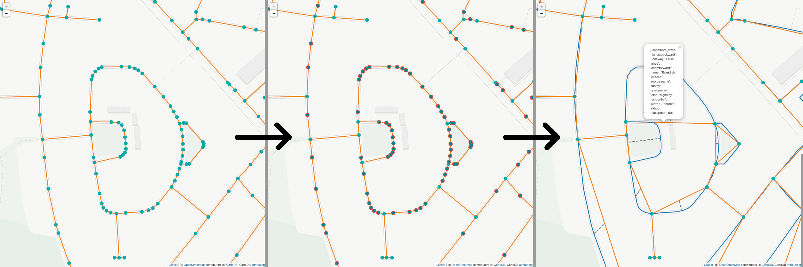

# Building Graphs
## Introduction
We use `LightOSM.jl` as a basis to handle all the downloading, saving and importing of OSM data. We provide functions
for (down)loading graphs which should feel very similar to any user of `LightOSM`.

The `LightOSM.OSMGraph` instance is parsed and simplified into a `MetaDiGraph`, preserving the topology of the original
street network, while reducing the number of nodes as much as possible. The geometry and various other parameters are attached
to the `props` of every edge and vertex.

One noteable difference to the `LightOSM` graphs is that we take special care to not assume anything about the dataset from OSM.
Therefore, whenever there is no information available about a certain tag, we parse it as `missing`, rather than setting a default
value.



## API

```@index
Pages = ["BuildGraph.md"]
```
```@meta
CurrentModule = ShadowGraphs
```

### Exposed functions
```@docs
shadow_graph_from_file
shadow_graph_from_download
```

### Internals
```@docs
shadow_graph_from_object
shadow_graph_from_light_osm_graph
add_edge_with_data!
geolinestring
get_all_node_lists
decompose_way_to_primitives
get_rotational_direction
countall
add_this_node
is_circular_way
is_end_node
parse_raw_ways
parse_lanes
width
```